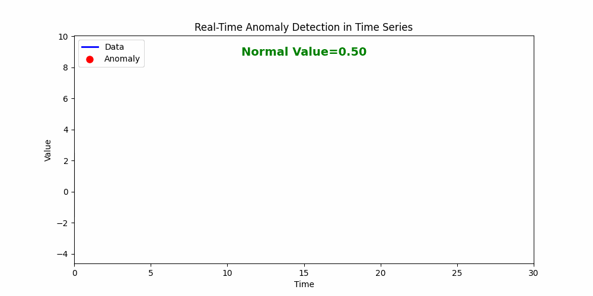

# 𝐑𝐞𝐚𝐥-𝐓𝐢𝐦𝐞 𝐀𝐧𝐨𝐦𝐚𝐥𝐲 𝐃𝐞𝐭𝐞𝐜𝐭𝐢𝐨𝐧 𝐢𝐧 𝐓𝐢𝐦𝐞 𝐒𝐞𝐫𝐢𝐞𝐬

This repository demonstrates **real-time anomaly detection in time series data**. It provides a visual, real-time way to spot unusual events, useful in industries like manufacturing, IT monitoring, finance, and IoT systems.

---

## Features

- Real-time detection with instant alerts.
- Visual line chart: normal values in blue, anomalies in red, green shaded normal range.
- Dynamic top-center text showing "Normal" (green) or "Anomaly Detected!" (red).
- Rolling window animation simulates live data streams.
- Easy to run, fully self-contained Python script.

---

## Demo

